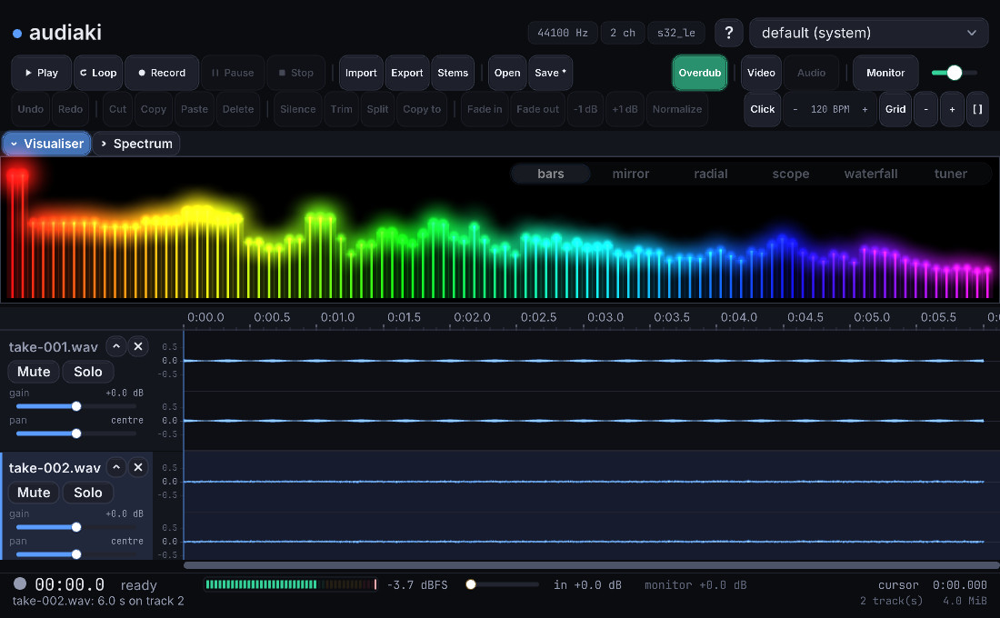
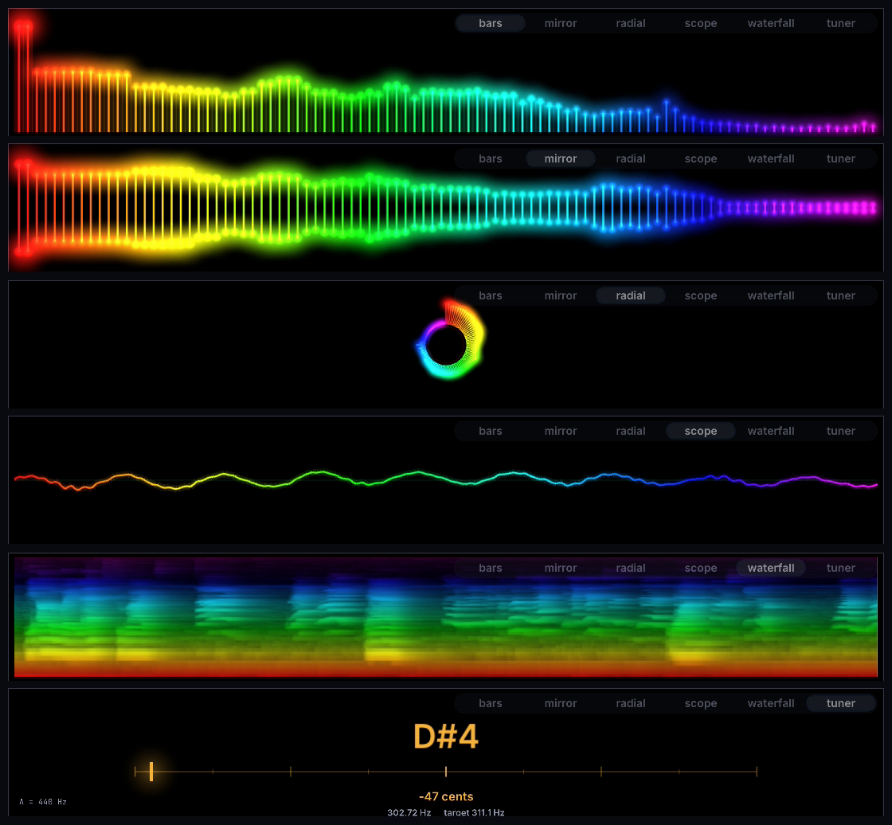

# The desktop app

`audiaki-gui` is a multi-track recorder and editor over the same capture and
analysis core as the command line recorder: a transport, a timeline you can cut
about, playback monitoring and a live glowing spectrum. The
[README](../README.md) is the short version, [USAGE.md](USAGE.md) covers the CLI,
and [DESIGN.md](../DESIGN.md) covers why it is built this way.

<p align="center">
  
</p>

- [Building it](#building-it)
- [Options](#options)
- [The layout](#the-layout)
- [Recording onto the timeline](#recording-onto-the-timeline)
- [Playing it back](#playing-it-back)
- [Counting the bars](#counting-the-bars)
- [Editing](#editing)
- [Exporting](#exporting)
- [Controls](#controls)
- [Keeping a take](#keeping-a-take)
- [Recording video](#recording-video)
- [The visualisers](#the-visualisers)

## Building it

`audiaki-gui` needs [raylib](https://www.raylib.com/), which Debian and Ubuntu
do not package, so it is vendored as a submodule pinned to the version the
visualiser was drawn against.

```sh
./scripts/install-deps.sh              # OpenGL and X11 headers included
git submodule update --init --depth 1  # fetch raylib
make                                   # both binaries; raylib compiled once
```

Installing those headers by hand instead, on Debian or Ubuntu:

```sh
sudo apt install libgl1-mesa-dev libx11-dev libxrandr-dev libxi-dev \
                 libxcursor-dev libxinerama-dev libxkbcommon-dev
```

None of this is required for the command line recorder. With the submodule
uninitialised, `make` quietly builds `audiaki` alone and skips the window —
which is what you want on a headless machine. `sudo make install` also installs
a `.desktop` entry.

## Options

```sh
audiaki-gui                          # open the window on the default device
audiaki-gui -D plughw:CARD=Box,DEV=0 # ...on a particular interface
audiaki-gui -b alsa                  # ...through a particular backend
audiaki-gui -o session               # name takes session-001.wav and up
audiaki-gui --dir ~/Takes            # ...written in that folder
audiaki-gui --no-dialog              # never ask where a take should go
audiaki-gui -s waterfall             # start on a particular visualiser
audiaki-gui -s tuner                 # ...come up as a tuner
audiaki-gui -V                       # also render an MP4 of each take
audiaki-gui -V --video-size 1080p    # ...at a particular size
audiaki-gui -V --video-silent        # ...with no audio track in it
audiaki-gui -M                       # come up already monitoring
audiaki-gui --preroll 10             # start each take 10 s before Record
audiaki-gui --no-overdub             # do not play the project while recording
audiaki-gui --latency 14             # place overdubs by a measured round trip
audiaki-gui --tempo 96               # count the ruler in bars at 96 BPM
audiaki-gui --click 96               # ...and play a metronome at it
audiaki-gui --click 96 --click-beats 3   # ...in three
audiaki-gui --click 96 --click-gain 0.8  # ...louder
audiaki-gui --grid                   # come up with the bar grid on
audiaki-gui --loop                   # come up looping whatever Play is given
audiaki-gui take01.wav take02.wav    # open takes as tracks straight away
audiaki-gui yesterday.aki            # ...or open a saved session
```

`--video-size` takes `WxH` or `720p`/`1080p`/`1440p`/`2160p`, and `--video-fps`
the frame rate; the defaults are 1280x720 at 60.

The capture stream opens with the window and stays open, so the spectrum moves
and the meter reads before you press anything — setting an input level should
not mean starting a take you are going to throw away. With `--preroll` those
seconds are kept rather than discarded, and Record starts the take that far
back.

## The layout

Top to bottom: the title and the capture device, a transport bar, an edit bar,
a drawer, the time ruler, the tracks, and a status bar.

The drawer holds two panels and shows one at a time. **Visualiser** (`B`) is
what is arriving from the interface right now; **Spectrum** (`N`) is what is
already on the timeline, and can be drawn on — see [Taking the noise
out](#taking-the-noise-out). Either arrow shuts its panel and gives the room
back to the tracks. The visualiser keeps running while it is shut, so opening it
shows what is happening now rather than an empty panel filling up; the spectrum
does not, because it reads the timeline rather than the interface and reading a
take nobody is looking at would cost real work for nothing.

Each track has a control column of its own — its name, **Mute**, **Solo**, a
gain slider and a pan slider, with `x` to close it and `^` to fold it down to a
strip. Dragging the line under a track makes it taller. Beside it is a strip of
amplitude labels, and then the waveform: the peak envelope in deep blue with the
RMS as a lighter core inside it, so how loud it got and how loud it is are both
legible at a glance.

## Recording onto the timeline

Click where you want the take to start and press **Record**. The waveform grows
along the timeline as you play, the way it does in Audacity — what you are
seeing is the same audio going into the WAV, frame for frame, not a preview of
it.

Where it lands: at the cursor, on the selected track if that track is free from
there on, and on a new track otherwise. So clicking further along a take and
pressing record again adds to that take; clicking over audio that is already
there gives the new one a lane of its own rather than refusing or overwriting.

The take is a real WAV on disk the whole time — numbered from the prefix, in
`take_dir` — so an interrupted session is not a lost one. It is also on the
timeline the moment it stops, ready to cut about, without a dialog in between.

## Turning a quiet input up

The level to fix first is on the hardware — the knob on the interface, or the
capture volume in `alsamixer`. A gain stage ahead of the converter captures more
of its range; anything done afterwards only scales the range already captured,
noise and all. Check that a bass is going into an instrument or Hi-Z input
rather than a line input while you are there.

Some inputs have no knob. For those there is the **in** slider on the status
bar, immediately right of the level meter — which is where it is precisely
because setting an input level means watching a needle, and the needle is there.
It reads out in dB, and goes from silent to +24 dB.

It applies to each period as it arrives, before anything measures it, so the
meter, the visualiser, the spectrum panel and what you hear through **Monitor**
are all describing the recording rather than the device. What the meter says is
what lands in the file.

`--gain 2.0` sets it at startup, and `gain = 2.0` in the config file sets it
every time — worth doing when it corrects a property of your interface rather
than of today's session.

**This one can ruin a take.** Unlike the monitoring level beside it, it reaches
the file, and samples pushed past full scale are held there for good. A take
that came in quiet is merely quiet — the window records 24-bit, so there is
plenty of room to bring it up afterwards with the track's own gain slider, or in
the spectrum panel, losing nothing. Software gain on the way in buys nothing
over doing it afterwards except not having to; what it costs is a recording you
can damage. Aim for peaks around −6 dBFS and turn the hardware up first.

## Playing it back

`space` plays: the selection if there is one, otherwise from the cursor to the
end. `space` again, or **Stop**, or `S`, stops it. The playhead runs along the
tracks and the view follows it.

What you hear is the mix — every track that is not muted, at its gain and pan,
with solo taking over the moment any track has it. It is the same mix **Export**
writes, which is the point of it being one piece of code.

**Loop**, or `L`, plays it round and round instead of stopping at the end.
Select a bar and it repeats that bar until you stop it — which is what learning
one is — and select nothing and it repeats from the cursor to the end. The
bounds are fixed when playback starts, so moving the selection while it runs
does not move the loop out from under you; stop and play again to move it.

It can be turned on and off while something is playing, so a passage can be put
on repeat without stopping it first. Recording never loops: a take runs
straight through, and a loop underneath one would be music that repeated behind
a performance that did not.

## Counting the bars

A session has a tempo. It is 120 to the bar of four until you say otherwise,
and it is saved with the session rather than with the window — two people
opening the same project see the same bar lines.

The tempo cluster at the end of the edit bar is the whole of it: **Click**,
`− 120 BPM +`, and **Grid**.

- **Click**, or `C`, plays a metronome over whatever else you are hearing. It
  is mixed into the output on its way to your headphones and nowhere near the
  file — the take is written from the samples the interface delivered, whatever
  was being played to the person making it. It runs under playback, under an
  overdub, and on its own over an empty timeline, which is what a count-in is.
- `−` and `+`, or the `-` and `+` keys, move the tempo a beat at a time; hold
  `shift` for ten. It can be nudged while something is playing, which is how
  anybody actually arrives at a tempo — against what they are already hearing.
- **Grid**, or `G`, counts the ruler in bars instead of minutes and seconds,
  draws the lines down the tracks, and puts edits on them: clicking, scrubbing,
  dragging a selection and the `←`/`→` keys all land on the nearest line.
  Holding `alt` steps off the grid for the one cut that has to go between two
  beats — for the keys as well as for the pointer.
- `shift+G` divides the grid, cycling bars → beats → halves → thirds →
  quarters. Bars are for arranging, thirds for anything shuffled, quarters for
  placing a hit inside a beat; the status line says which you are on, and so
  does the tooltip on the **Grid** button. It is saved with the session, and a
  project written before this existed opens on beats.

Dividing the grid changes where the *next* edit lands. It does not move audio
that is already on the timeline, and neither does turning the grid on.

The grid thins itself out as you zoom away — subdivisions give way to beats,
beats to bars, and bars double until they are far enough apart to be lines
rather than a wash. What is drawn is always something an edit can land on, and
the three weights of line — bar, beat, and between beats — are the same on the
ruler and down the tracks.

The metronome and the ruler count the same grid, from the same tempo, both
computed from the frame index rather than accumulated: beat 400 is where the
arithmetic says it is, and the click you hear lands on the line you can see
however long the session runs. That also survives a loop's seam — the click
does not restart the bar wherever the loop happens to begin.

**A click you play along to costs you the same round trip an overdub does**, so
recording to one places the take a round trip earlier for the same reason and
by the same measurement. See [Overdubbing](#overdubbing).

The click counts out whatever the grid is divided into, so a session snapping to
thirds is counted in thirds and one snapping to bars is still counted in beats —
a metronome that struck once a bar would not be one anybody could play to.

There is one tempo for the whole session: no tempo changes, and no time
signature beyond how many beats get counted to a bar.

## Editing

Drag across a track to select time; `ctrl`+click another track to take it into
the selection as well; `ctrl+A` selects everything. Then:

| | |
| --- | --- |
| **Cut** / **Copy** / **Paste** | `ctrl+X` / `ctrl+C` / `ctrl+V` |
| **Delete** | `del` — removes the selection and closes the gap |
| **Silence** | empties it and leaves the timing alone |
| **Trim** | throws away everything outside the selection |
| **Split** | cuts the clips at the selection's edges without removing anything |
| **Copy to** | the selection onto a new track of its own, at the same position |
| **Fade in** / **Fade out** | `[` / `]` — ramps the selection out of silence, or into it |
| **Undo** / **Redo** | `ctrl+Z` / `ctrl+shift+Z`, 64 steps deep |

### When it stops to ask

Most edits just happen. Four things put a question up first, and the rule is
narrow on purpose — a confirmation that appears constantly is one nobody reads,
which makes the dangerous case worse rather than better:

| | |
| --- | --- |
| An edit over **10 seconds** of audio | Counted across every lane it touches — 2 s across six tracks is twelve seconds |
| An edit that **empties the project** | Whatever its length. `ctrl+A` then `del` on a short session still asks |
| **Closing a track** | Always. It takes every clip on the lane, and it is a small button next to a name |
| Any edit **after you have undone something** | This is the one that matters — see below |
| **Apply** in the spectrum panel | It rewrites audio and writes a file, unlike every other edit |

**Ctrl+Z is not guarded.** Undo is the way back out of a mistake, and making
that harder would be exactly the wrong thing. The one exception is undoing a
spectral repair, which asks because the `cleaned-NNN.wav` it wrote stays on disk
with nothing pointing at it — redo still needs it, so it cannot be deleted for
you.

The one worth reading is the third. Once you have undone a few steps, making any
new edit **silently discards everything you could have redone** — that is how
every editor works, and it is invisible. The dialog names the number:

```
Delete, and lose what you undid?
  3 steps you could have redone will go, and no undo brings them back.
```

Escape or **Cancel** backs out of any of them.

Pasting over a selection replaces it, the way typing over selected text does.
None of this copies audio about — see [DESIGN.md](../DESIGN.md#the-editor) — so
cutting an hour-long take is as quick as cutting a bar of one, and so is undoing
it.

`ctrl`+wheel zooms about the pointer, `shift`+wheel scrolls, the wheel alone
walks up and down the tracks, and `F` fits the selection or the whole project to
the window.

The arrow keys drive the same thing without the pointer. `←` and `→` move the
cursor by about eight pixels' worth — so a nudge is the same gesture whatever
the zoom, coarse when a whole session is on screen and sample-accurate when one
transient is. `ctrl` steps clip edge to clip edge instead, which is where a trim
usually wants to land; `home` and `end` go to either end of the project. Holding
`shift` moves the far end of the selection rather than the cursor, growing it
from wherever it started rather than from the left, and `↑`/`↓` walk the track
selection up and down the stack, scrolling it into view.

The cursor is where the next edit goes. The playhead — where the audio has
actually got to — is drawn separately while something is playing or recording,
so moving the cursor during playback moves one and not the other.

A fade is a length on the clip rather than something written into the audio, so
it costs nothing, undoes like everything else, and can be taken off again by
fading a zero-length selection. The waveform follows it, so what you see is what
you will hear. A cut that lands inside an existing ramp truncates it: a clip can
say "ramp up from silence", and there is no way for one to say "carry on from
half way up a fade that began in the clip before".

There are no crossfades. Clips on a lane do not overlap — that is the invariant
the whole editor is built on — and a crossfade needs two pieces of audio
sounding at once. Fading one out and the next in gives a dip, not a crossfade,
and calling it one would be a lie.

## Taking the noise out

Press `N`, or the **Spectrum** arrow in the drawer. The panel shows the
frequency content of whatever is selected — or of the whole track when nothing
is — as a graph: frequency across the bottom on a log scale, level up the side
in dBFS.

Three traces. The faint shading behind is the loudest each frequency ever got;
the grey line is the average; the **blue** line is what you would be left with
after the edit currently drawn. Bands being taken out are shaded red across the
full height, so a notch you left in an hour ago is not something you have to go
looking for.

The graph is the edit. There is no list of filters anywhere — the line on screen
*is* the gain curve, and applying multiplies the audio by it.

### Dragging it out

**Drag on the graph** to pull the spectrum down to wherever the pointer is. That
is the whole gesture: a hum is a spike standing out of the floor around it, so
you drag the spike down to the floor and it is gone. **Right-drag** puts a band
back to where it was.

The **brush** slider — or the wheel over the graph — sets how wide a stroke is,
as a fraction of an octave. Narrow for a hum, wide for a whole region.

### A mains hum, all of it at once

**Find hum** looks for a steady tone between 30 and 130 Hz and offers its
frequency. **Notch** then takes that frequency *and its harmonics* out in one
go, as many as the **harmonics** slider asks for.

The harmonics are the point. Mains hum is never the fundamental alone — take 50
Hz out and 100, 150 and 200 Hz go on buzzing — and finding each by hand on the
graph is exactly the tedium this removes. Six is a sensible number for a bass
plugged into an interface with a ground loop somewhere in it.

Find hum works on the *quietest* each frequency ever got rather than the
average, which is what lets it tell a hum from a note: a hum is present in every
window and cannot fall below itself, while a bass note comes and goes.

### Hiss, which has no spike to point at

Broadband noise — hiss, a noisy preamp, a single-coil buzzing at everything at
once — has no peak to drag down. For that there is a noise profile: an estimate
of the noise on its own, subtracted from every frame, so quiet bins fall away
and the notes are barely touched.

Two ways to get one:

| | |
| --- | --- |
| **Learn** | select a stretch with nothing played on it — the count-in, the tail after the last note — and press this. Press it again to forget the profile |
| **Guess** | works it out from whatever is selected, with no silent stretch needed |

**Guess** is the one to reach for first. It takes the quietest each frequency
ever fell to across the selection, which for a steady noise is the noise itself:
it is in every window, while anything played is in some of them and gone in the
rest. Select the whole take, press **Guess**, and the orange line that appears is
what was underneath all of it.

Then two sliders. **reduce** is how hard the profile is subtracted — above 1 it
oversubtracts, which is the usual way to get the last of a hiss out. **floor**
is how far down it is allowed to pull. Less is gentler: driving a bin to nothing
while its neighbours stay loud is what makes spectral noise reduction warble, and
a shallow floor trades a little remaining hiss for none of that. Start at `1.00x`
and `-18 dB` and go further only if you need to.

### Applying it

Nothing has happened to the audio until you press **Apply**. **Reset** puts the
whole curve back to flat.

**Apply** replaces the selected range with the filtered version, and it is one
press of `ctrl+Z` like any other edit — so the honest way to work is to apply,
play it back, and undo if you took too much.

Applying puts the curve back to flat and lets the noise profile go, because the
edit is in the audio now. Leaving either up would mean the graph showing a notch
over audio it has already been taken out of, and a second press of **Apply**
quietly taking it out twice.

Two things are worth knowing. Unlike every other edit, this one really does
rewrite audio, so it costs a moment and some memory on a long range rather than
being instant. And it writes a `cleaned-NNN.wav` into your takes folder as it
goes, because a session records *which parts of which files sit where* and audio
that came from nowhere could not be saved. Undoing does not delete that file —
redo still points at it — so an undone repair leaves a WAV behind that nothing
refers to, which is a file to delete at your leisure.

## Sessions

The takes are files the moment they stop. What you have *done* to them — the
cuts, the levels, which clip sits where — is the session, and **Save** or
`ctrl+S` writes that to a `.aki` file. `ctrl+shift+S` asks where; **Open** or
`ctrl+O` opens one; `audiaki-gui yesterday.aki` opens one at startup.

A session refers to its takes rather than containing them, so it is a few
kilobytes of readable text whatever it holds, and it can be opened in an editor
and fixed by hand. Takes kept beside the session file are referred to relatively,
so a session folder can be copied to another disk and still open. Move a take
somewhere else and the session says which one is missing rather than opening
with a silent lane.

Closing the window with unsaved edits asks first, and says what will happen to
them either way — they are written out rather than dropped: back to the session
file if there is one, and to `recovered.aki` beside the takes if there is not.
The question is there because a file you did not know was written is a file you
will not go looking for. A take still recording is named in the same dialog; it
is a finished WAV whichever answer you give.

`audiaki --render session.aki -o mix.wav` mixes a session down without opening a
window at all, which is what makes a session something a script can use.

## Overdubbing

Press **Record** with something already on the timeline and it plays while you
record over it. That is what **Overdub** is, and it is on by default; turn it off
to record a second take in silence.

Playing along to something means hearing it first, and hearing it costs time —
the output holds a buffer, then the capture side hands over a period at a time.
So what you played in response to a beat does not arrive labelled with that
beat; it arrives a round trip late. The window corrects for it by placing the
take a round trip earlier than you pressed the button, because that is when the
sound was actually made.

**That only happens when there is something to play along to.** Recording from
past the end of the project, with Overdub off and the metronome off, or with no
output to play through, there is nothing to be late against — so the take starts
exactly on the line you put it on, which is what you asked for. A correction is
a guess about a delay, and guessing when nothing was played would move the take
off the line for no reason.

A metronome counts as something to play along to. It reaches you down the same
output and costs the same round trip, so recording to a click gets the same
correction — including with Overdub off, where the click plays and the project
does not.

The correction is estimated from the two queues, which is a starting point and
not a measurement: the converters, the driver and the interface all add delay
that nothing here can see. If your overdubs land consistently late or early,
measure it. Connect the output to the input and let audiaki do it:

```
audiaki --calibrate
```

It plays a short sweep a few times, times how long each one takes to come back,
and offers to write the answer to the config file — which is where it belongs,
being a property of the machine rather than of the session, and where the window
reads it from:

```
latency_ms = 14
```

The whole of it is in [USAGE.md](USAGE.md#measuring-the-round-trip). To say it
for one run instead, without keeping it:

```
audiaki-gui --latency 14
```

What none of this fixes is jitter. Playback here is fed from the drawing loop
and capture runs on its own thread, so the two start within a drawn frame of
each other rather than on the same sample. Overdubs land close, not sample
locked. Use headphones: monitoring plus playback through speakers is two ways
for the room to get into the take.

## Exporting

**Export**, or `ctrl+E`, mixes down to a WAV: the selection if there is one,
the whole project if not. 24-bit by default, at the project's own sample rate,
and stereo unless every track in it is mono.

## Controls

| Control | Does |
| --- | --- |
| **Play** | Plays the selection, or from the cursor |
| **Loop** | Plays it round and round rather than stopping at the end |
| **Record** | Records onto the timeline at the cursor |
| **Pause** / **Resume** | Stops and continues writing, without closing the file |
| **Stop** | Closes the take; it is already on the timeline |
| **Import** | Opens a WAV as a new track |
| **Export** | Mixes down to a WAV |
| **Open** / **Save** | Opens a session, or writes this one out |
| **Click** | Plays a metronome at the session's tempo; heard, never recorded |
| `− BPM +` | The tempo, a beat at a time; `shift` for ten |
| **Grid** | Counts the ruler in bars, and puts edits on the grid |
| **Overdub** | Plays the project while recording over it |
| **Video** | Also render an MP4 of the visualiser when the take stops |
| **Audio** | Whether that MP4 carries the take's audio; off renders it silent |
| **Monitor** | Plays the input back through the default output |
| Volume slider | Monitoring level, from silent to +6 dB |
| **in** slider | Gain added to the recording itself — on the status bar, beside the meter. See [Turning a quiet input up](#turning-a-quiet-input-up) |
| Device dropdown | Switches capture device, `default` plus every capture PCM |

| Key | Does |
| --- | --- |
| `space` | Play, or pause and resume once a take is running |
| `R`, `ctrl+space` | Record from the cursor |
| `S` | Stop the take or playback, or cancel a video render |
| `L` | Loop what Play is given |
| `C` | The metronome |
| `G` | The bar grid; `alt` steps off it while it is on |
| `shift+G` | Divides the grid: bars, beats, halves, thirds, quarters |
| `-` / `+` | The tempo, a beat at a time; `shift` for ten |
| `I` / `ctrl+E` | Import a WAV / export a mix |
| `ctrl+S` / `ctrl+O` | Save the session / open one; `ctrl+shift+S` saves it as |
| `[` / `]` | Fade the selection in, or out |
| `←` / `→` | Move the cursor, one grid line at a time while the grid is on; `ctrl` steps clip edge to clip edge, `alt` steps off the grid |
| `shift+←` / `→` | Extend the selection instead of moving the cursor |
| `↑` / `↓` | Select the track above or below; `shift` adds it |
| `home` / `end` | Cursor to the start or the end of the project |
| `M` | Toggle monitoring |
| `B` | Show or hide the visualiser panel |
| `N` | Show or hide the spectrum panel, which is where noise comes out |
| `V` / `1`–`6` | The next visualiser style / one outright |
| `F` | Fit the selection, or the whole project |
| `F11` | Fullscreen |
| `?` | The list of keys, over the window; `Esc` closes it |

While the save dialog is up it has the keyboard and the rest of the window is
disabled behind it — including Record, so the take being named cannot be lost
to a keypress meant for the dialog.

The same list is behind the `?` in the header, because a shortcut nobody can
find is a shortcut nobody has. Resting the pointer on any control says what it
does and which key does it too — including the greyed-out ones, which is the
point: a disabled button is a question, and the answer should not be in here.

The window title carries the transport, so a window behind another one still
answers "is it still recording?" — `audiaki - recording 00:12 - take-003.wav`.

The device dropdown is disabled while a take is open: switching closes the
capture stream, which would truncate the recording. Stop first. The list
follows the hardware — plug an interface in and it appears a moment later, and
a window that came up with no device at all opens the first one plugged in.
Takes are always numbered from the prefix, so pressing record cannot destroy an
earlier take.

### When the device goes mid-take

A cable pulled out while a take is running ends the capture stream, and nothing
can revive that stream. What was played up to that moment is not at risk: the
WAV is closed and patched the instant the stream dies, and the clip that was
growing on the timeline becomes a finished one over that file. The window says
which take it was and how much of it it kept.

Plug the interface back in within **thirty seconds** and the take carries on in
the same file and the same clip, starting at the frame the first half stopped
at. One take, one WAV, one thing on the lane.

Nothing already written is rewritten to do it. The new frames go on the end of
the ones that are there and the header is patched when the take finally stops,
so a crash part way through the second half leaves the file exactly as long as
it was after the first — the same amount lost as a second file that never got
created, and the first half is never put at risk to save the second.

It has to be the same device to carry on with. One that comes back at another
rate or another channel count cannot be laid onto the end of a lane recorded at
the old one, and the window says so and waits for **Record** instead. After the
thirty seconds it does the same: the stream reopens either way, so nothing is
lost — a window left running is simply not going to start recording to disk on
its own because of something that happened half an hour ago.

A file that will not take the rest of the take — one something else has
appended to since — falls back to what this used to always do, a second take
butted against the first on the same lane. Two files is worse than one and much
better than losing the half that is coming.

**Monitoring feeds your input back to your speakers**, which will howl if you
are recording a microphone in the same room. It starts off for that reason.

## Keeping a take

Off by default in the window, and deliberately the other way round from the
terminal recorder: there a take is a file and the question is where to keep it,
here it lands on the timeline the moment it stops and a dialog between playing
something and editing it would be a dialog in the way. Where the WAV goes is
`--dir`'s job, and **Export** is how a finished mix leaves.

Turn it on with `prompt = yes` in the config file, and stopping opens a small
dialog over the window: the name the take was given, the folder it was written
in, and what is in that folder — the sub-folders to click through, and the WAVs
already there. The row the name field is pointing at is drawn as the current
one, so a take about to land next to yesterday's can be seen doing it.

Nothing has happened to the file when it opens. It is a complete, closed WAV
sitting exactly where it was recorded, and it stays there unless **Save** is
pressed — **Keep here**, `Esc` and closing the window all leave it alone. Save
moves it, creating the folder if it has to, and never lands on a file that is
already there: a name that is taken comes back as a line under the fields
rather than as a take you no longer have.

**Play** hears the take before any of that is decided — straight off the disk,
at its own rate and channel count, with nothing put on the timeline and no undo
step spent. It plays whatever the fields name when that is a readable WAV, and
the take being filed otherwise, so it starts out on the take and follows a row
once one is clicked: hear what you are about to file, or hear what you are
about to be told is in the way. The button says how far in it has got, and the
audition stops when the dialog does. **Import** and **Export** get the same
button.

**Browse…** hands the question to the desktop's own file chooser, which has the
bookmarks, the recent places and the search this one never will. It appears when
`zenity` or `kdialog` is installed — a KDE session gets `kdialog`, anything else
`zenity` — and under a sandbox both go through `xdg-desktop-portal`, which is
the one that gets it right. Whatever comes back lands in the two fields as
though it had been typed, so it can still be looked at and corrected before
either button is pressed; cancelling out of it leaves the dialog saying what it
said before.

The window keeps drawing and the take keeps recording while it is up: the
chooser runs beside audiaki rather than inside it, and is looked in on once a
frame. `AUDIAKI_FILE_CHOOSER` names which to use — `zenity`, `kdialog`, or
`none` to keep the built-in browser whatever else is installed.

**Hidden** lists dot files and dot folders. Off by default — hardly anybody
keeps takes in one, and showing them would be noise in every home directory —
but a folder like `~/.local/share` is otherwise out of reach of everything
except typing the path.

`Tab` moves between the two fields, `Enter` saves, `Esc` keeps it where it is.
Clicking a folder goes into it; `..` goes up. A path can also be typed or
pasted into the folder field, and the list follows it.

Where the take was written in the first place is `--dir`, or `take_dir` in the
config file — the same file the CLI reads, described in
[USAGE.md](USAGE.md#the-config-file). `--no-dialog` turns the question off again
for one run.

The same browser is what **Import** and **Export** open, asking their own
question: it lists the WAVs in a folder as well as its sub-folders.

With **Video** on, the render starts once the dialog is answered rather than
beside it: the MP4 is made from the take, and it should be made from wherever
the take ended up.

## Recording video

**Video** off is audio only — `take-003.wav` and nothing else. Video on writes
that same WAV and then `take-003.mp4` alongside it, showing whichever
visualiser was selected. It needs `ffmpeg` on `PATH`; without it the WAV is
still written and the window says why the video was not. **Audio** decides
whether that MP4 gets an audio track — on by default, off for a clip going into
an edit that already has the sound. Both are only settable between takes.

The video is rendered after the take stops rather than captured live, so it is
frame-accurate and cannot cost the recording an xrun — see
[DESIGN.md](../DESIGN.md#rendering-video). While it runs, **Stop** becomes
**Cancel** and the status line shows progress; cancelling removes the partial
video and keeps the WAV.

## The visualisers

<p align="center">
  
</p>

Six styles, switchable from the strip on the visualiser or with `V`:

| Style | Shows |
| --- | --- |
| `bars` | A stem per band with a glowing cap, growing from the floor |
| `mirror` | The same bars, opening from the centre line |
| `radial` | The spectrum wrapped into a ring, bass at the top |
| `scope` | An oscilloscope trace of the last few milliseconds |
| `waterfall` | A scrolling spectrogram, newest at the right |
| `tuner` | The note being played, and how far off it is |

The first five read the same analysis the CLI's `--spectrum` and `--visualize`
use. How each is drawn, and why: [DESIGN.md](../DESIGN.md#the-visualisers).
